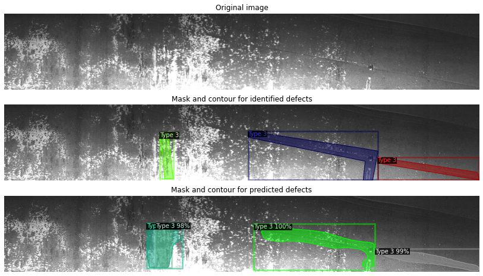

# Severstal Steel Defect Detection

For this project, a challenge proposed through **Kaggle** (https://www.kaggle.com) by **Severstal** (https://www.severstal.com/eng/) in 2019 is going to be studied: [Severstal: Steel defect detection, can you detect and classify defects in steel?](https://www.kaggle.com/c/severstal-steel-defect-detection)

The goal of this challenge was to help the company to develop a computer vision model able to detect and to classify defects on flat steel sheets, which are key elements Severstal works on. Indeed, after having created Russia's largest industrial data lake, with petabytes of data that were previously discarded, the company is now looking to machine learning to improve automation, increase efficiency, and maintain high quality in their production. The production process of flat steel sheets is especially delicate: From heating and rolling, to drying and cutting, several machines touch flat steel by the time it’s ready to ship, and today, Severstal wants to use images from high frequency cameras to power a defect detection algorithm, with the aim to keep manufacturing standards for steel high and enable the company to continue its innovation and maintain its leading role in metallurgy.

Particularly, in this projet, to tackle the problem, **Detectron2** (https://github.com/facebookresearch/detectron2) and **TorchServe** (https://github.com/pytorch/serve) frameworks were mobilized.

Detectron2, released on October 10, 2019, was initially built to meet the research needs of Facebook AI and to provide the foundation for object detection in production use cases at the company (e.g., it is now used to rapidly design and train the next-generation pose detection models that power Smart Camera, the AI camera system in Facebook’s Portal video-calling devices): By relying on Detectron2 as the unified library for object detection across research and production use cases, Facebook is able to rapidly move research ideas into production models that are deployed at scale. PyTorch-based, Detectron2 aims to be modular, with extensible design possibilities, includes new models and features (high-quality reference implementations for many state-of-the-art algorithms), new tasks and put a focus on implementation quality, speed and scalability. Detectron2 aspires to become a reference computer vision framework for both research-first use cases and production-oriented use cases.

TorchServe is an open source model server which was released last April (April 21, 2020) and originated from both PyTorch and AWS teams work. It aims to provide a performant and lightweight model server that facilitates deploying and managing models in production environments (building bespoke prediction APIs, scaling them, securing them, etc). Although yet experimental, this framework, officially supported and maintained by PyTorch and AWS communities, promises to offer a dedicated and production ready solution to serve PyTorch models (low latency prediction API, multi-model serving, model versioning for A/B testing, monitoring metrics, RESTful endpoints for application integration, etc), with nice-to-have flexibility to use it in various contexts (machine learning environments like Amazon SageMaker, container services, Amazon Elastic Compute Cloud (EC2), on-premise servers, etc).

In this repository, you will find the following files and folders:
* The file ***severstal-environment.yml***, the Conda environment file, with all packages and versions, to reproduce the work performed during this project;
* The folder ***graphs***, which contains all the graphs obtained during the study;
* The folder ***images***, which contains the images used to illustrate the challenge;
* The folder ***notebooks***, which contains all the Jupyter notebooks used to tackle the problem exposed in the challenge;
* The folder ***torchserve***, which contains all the files needed to serve, thanks to TorchServe, the Detectron2 model we trained, and equally all the files generated by running a session.

*Nota Bene:* Due to the weight of the files they contain, the folders *data* and *models*, mentioned in the Jupyter notebooks, are not provided here (as well as *detectron2_model.pth* and *severstal_detectron2.mar* files in *torchserve* folder).

Below, you can find some illustrations of the defect detection performed by the trained model:

  
  

  
  

  

  
  

  

